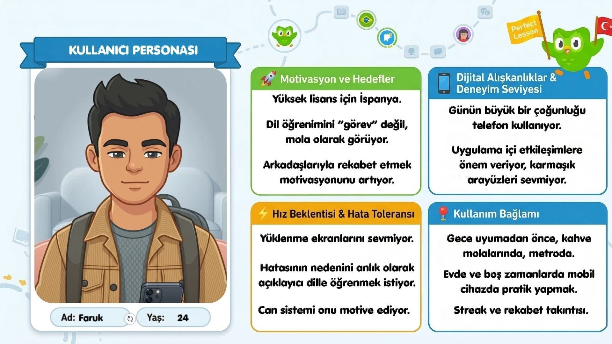
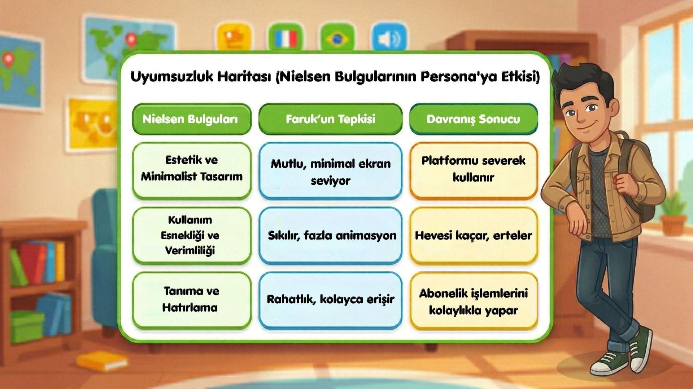
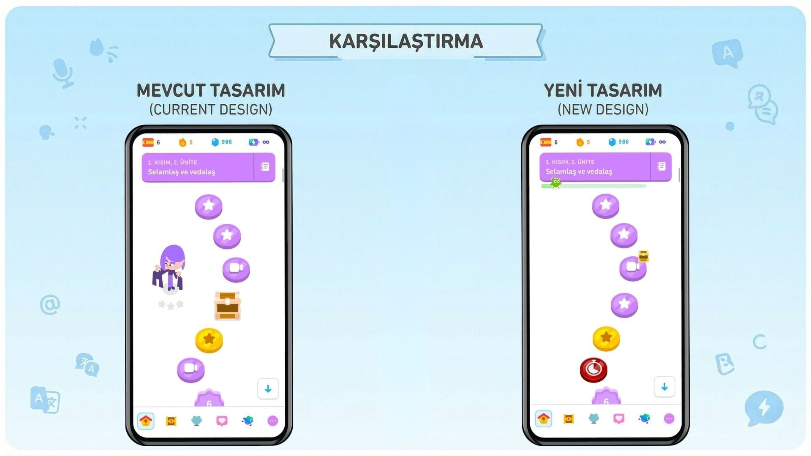

# 🦉 Duolingo - Product & Gamification Analysis

Bu çalışma, **Duolingo** mobil uygulamasının kullanıcı tutundurma (retention) stratejilerini, oyunlaştırma (gamification) mekaniklerini ve UX/UI yapısını inceleyen bir ürün analizi vaka çalışmasıdır (Case Study).

---

## 📊 Analiz Kapsamı ve Öne Çıkanlar
Proje kapsamında aşağıdaki başlıklar detaylıca incelenmiştir:

* **Oyunlaştırma (Gamification) Dinamikleri:** Streak (seri) sistemi, ligler, XP puanlama ve rozet mekanizmaları.
* **Kullanıcı Deneyimi (UX/UI):** Mikro etkileşimler, bildirim (push notification) psikolojisi ve onboarding süreçleri.
* **İş Modeli:** Freemium yapı, Duolingo Super ve AI destekli Duolingo Max incelemesi.

---

## 🖼️ Sunumdan Öne Çıkan Slaytlar

---

## 📄 Tam Sunum Dokümanı
Sunumun tamamını PDF olarak doğrudan GitHub üzerinden inceleyebilirsiniz:

👉 **[Duolingo_Product_Analysis.pdf](./DuolingoTasarımAnalizi.pdf)**

---
